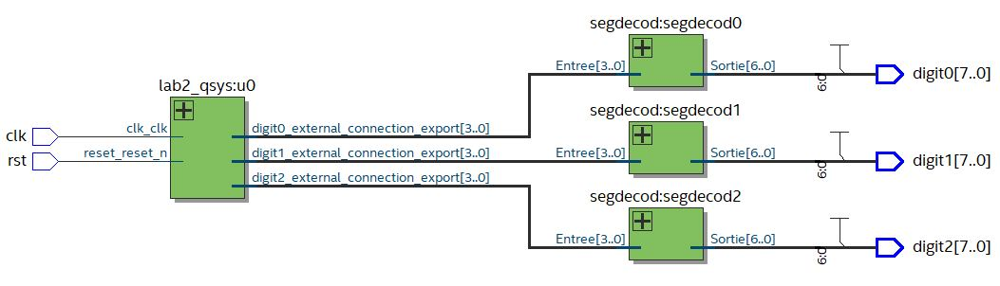

# FAUGERE_lab2

---------------------

Ce programme affiche un compteur BCD sur les 3 premiers afficheurs 7 segment.
Un timer est utilisé (IP) pour générer des interruptions (ici toutes les 1 secondes).
Le résultat du compteur est affiché en BCD (digit0 : 4 LSB, digit1 : 4 bits suivants, digit2 : 4 MSB).
Le compteur est automatiquement remis à zéro lorsque l'afficheur affiche FFF.

---------------------

.